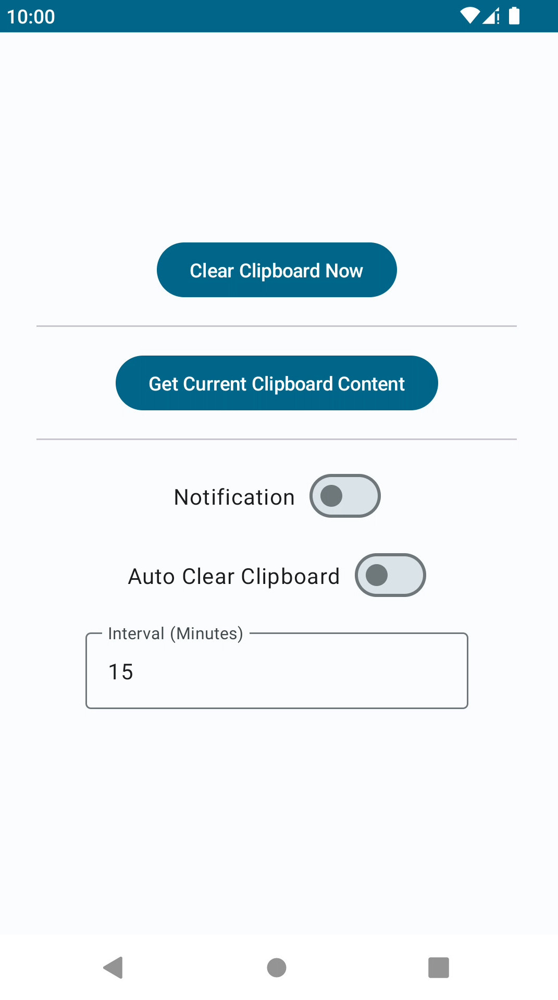
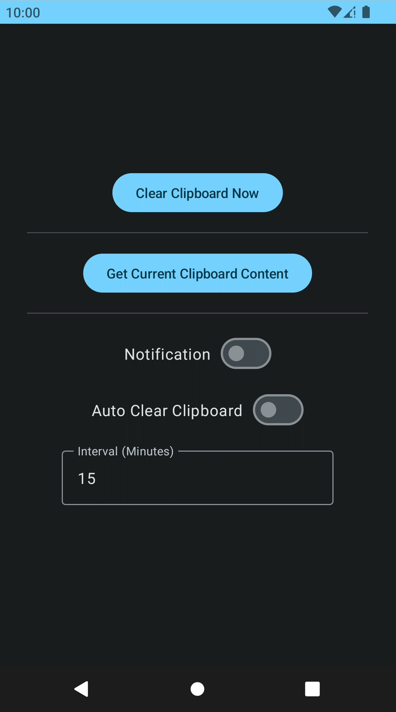
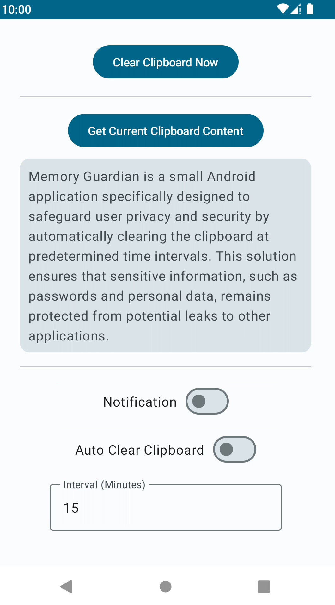
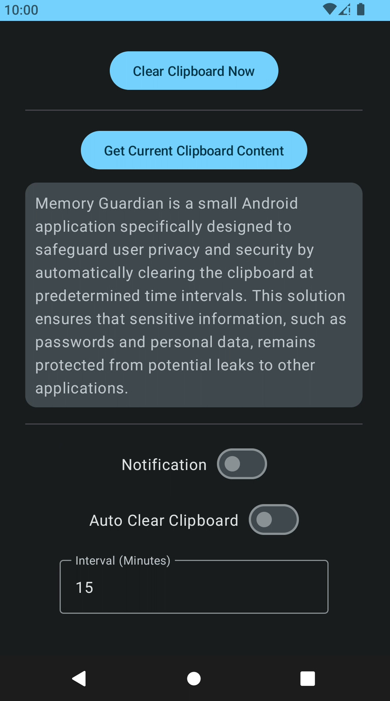

# Memory Guardian

A Small App for Enhanced Privacy & Security

**Memory Guardian** is a small Android application specifically designed to safeguard user privacy and security by automatically clearing the clipboard at predetermined time intervals. This solution ensures that sensitive information, such as passwords and personal data, remains protected from potential leaks to other applications.

In today's digital age, the clipboard is an essential tool for conveniently copying and pasting text, images, and other content across applications. However, this convenience comes at a cost: once information is copied to the clipboard, it can be accessed by various applications, potentially exposing users to privacy breaches and security risks.
To address this issue, **Memory Guardian** employs a user-friendly interface and customizable settings that enable individuals to select the frequency at which their clipboard is automatically cleared. By doing so, the app minimizes the risk of unauthorized access to critical information, fostering a safer digital environment for users.
Moreover, **Memory Guardian** provides users with the peace of mind that their sensitive data is no longer lingering on the clipboard, and they can safely copy and paste content without worrying about potential data leaks.

In addition to its core functionality, **Memory Guardian** offers a host of supplementary features, such as:

- Customizable time intervals: Users can choose the exact time intervals at which their clipboard is automatically cleared, tailoring the app to their unique needs and preferences.
- Manual clipboard clearing: For those who require immediate clearance of their clipboard, the app provides a simple "Clear Clipboard Now" button to quickly and easily remove all content.
- Notification options: Users can opt to receive notifications when the clipboard is cleared, ensuring they are always informed about the status of their sensitive information.
- Lightweight and efficient: Designed with performance in mind, **Memory Guardian** consumes minimal system resources, ensuring a smooth and seamless user experience.

## Screenshots (needs to be updated)

## Download

Get the latest APK from the [Releases Section](https://github.com/hashemi-hossein/memory-guardian/releases/latest)

