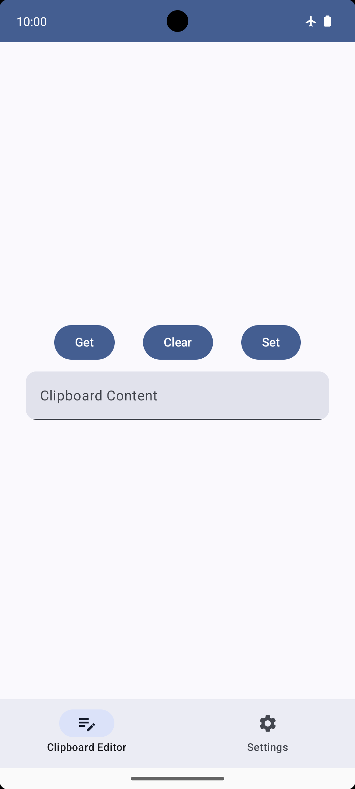
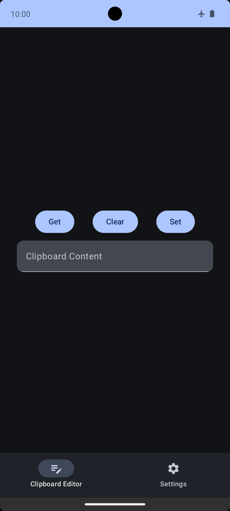
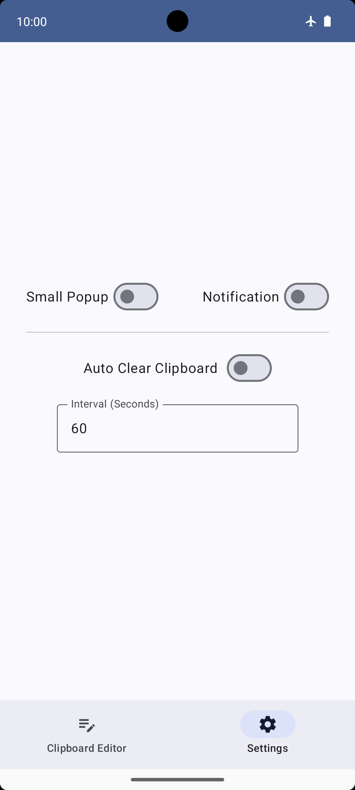
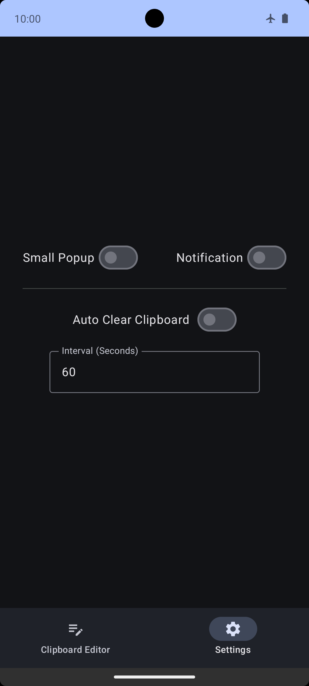

# Memory Guardian

A Small App for Enhanced Privacy & Security

**Memory Guardian** is a lightweight Android app that enhances user privacy and security by automatically clearing the clipboard at set intervals. This helps protect sensitive information, like passwords, from potential leaks to other applications.

**Key Features:**

- **Automatic Clearing:** Set customizable intervals for automatic clipboard clearing.
- **Manual Clearing:** Use the "Clear" button for immediate action.
- **Clipboard Editing:** Edit clipboard content directly within the app for quick adjustments.
- **Notifications:** Get notified when the clipboard is cleared.
- **Dark Mode:** Switch between light and dark themes for a personalized experience.
- **Tiny:** The app is small in size and does not consume much storage space.
- **No Permissions:** Memory Guardian does not require any permissions to function, ensuring user privacy.
- **No Ads:** Enjoy an ad-free experience with no interruptions.
- **Minimalistic:** Experience a clean and clutter-free interface for a distraction-free user experience.
- **Open Source:** Contribute to the project and help improve the app for everyone.

## Screenshots

## Download

Get the latest APK from the [Releases Section](https://github.com/hashemi-hossein/memory-guardian/releases/latest)

